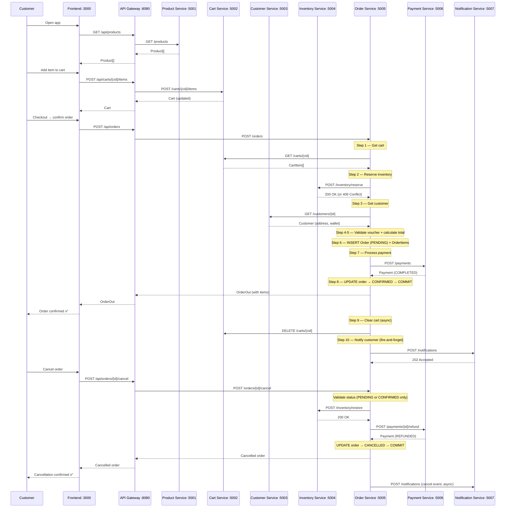
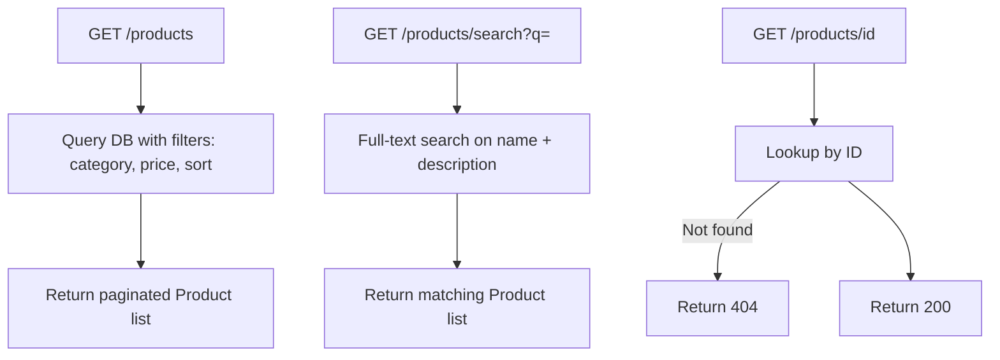
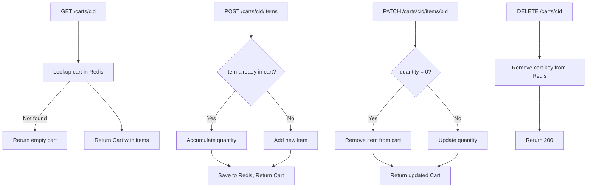
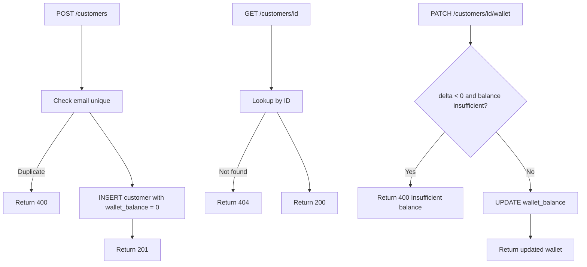
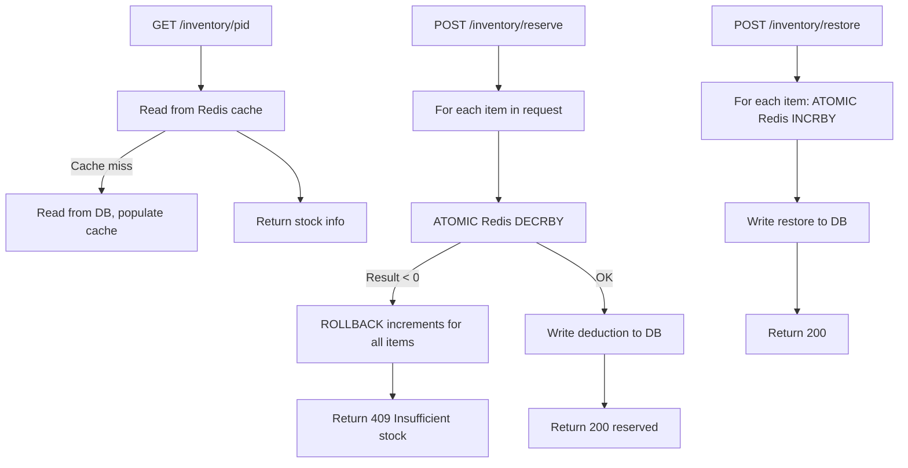
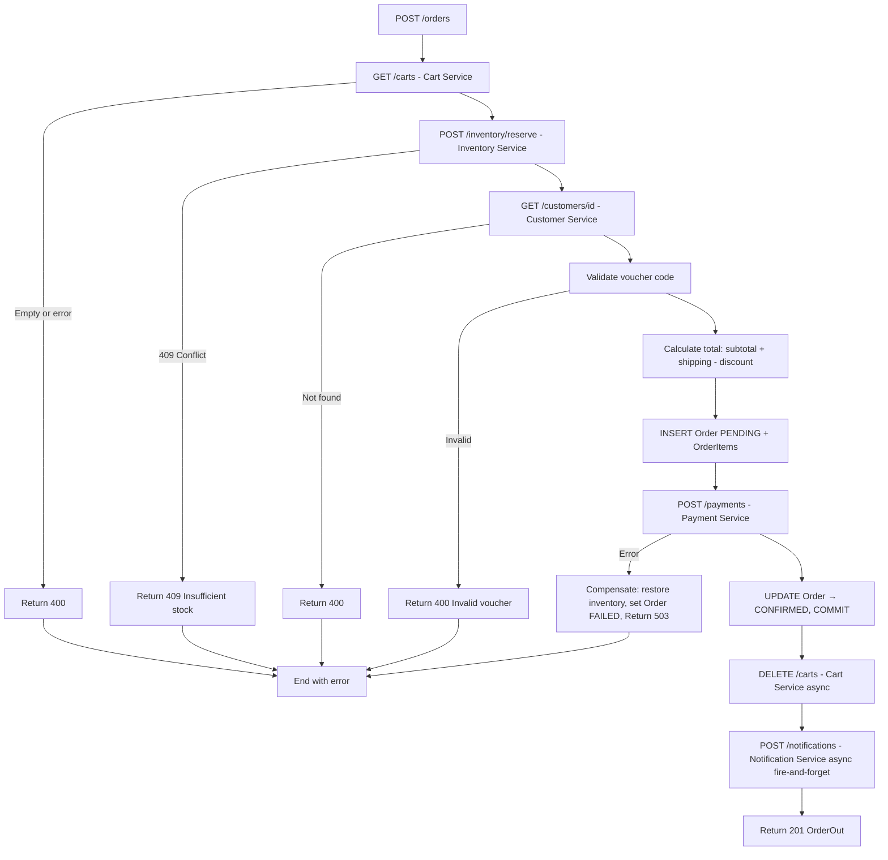
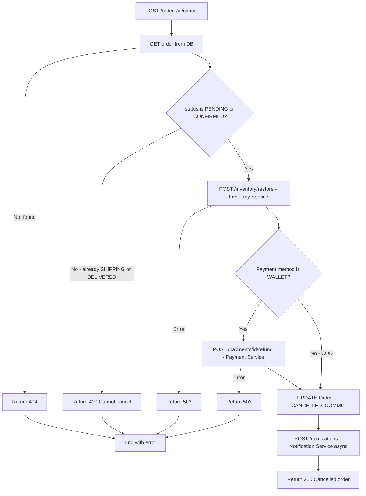

# Analysis and Design — Order Processing System

> **Goal**: Analyze a specific business process and design a service-oriented automation solution (SOA/Microservices).
> Scope: 4–6 week assignment — focus on **one business process**, not an entire system.
>
> **Target decomposition**: 7 microservices — **Product · Cart · Customer · Inventory · Order · Payment · Notification**

**References:**
1. *Service-Oriented Architecture: Analysis and Design for Services and Microservices* — Thomas Erl (2nd Edition)
2. *Microservices Patterns: With Examples in Java* — Chris Richardson
3. *Bài tập — Phát triển phần mềm hướng dịch vụ* — Hung Dang (available in Vietnamese)

---

## Part 1 — Analysis Preparation

### 1.1 Business Process Definition

Describe the high-level Business Process to be automated.

- **Domain**: Ecommerce — Online Grocery / General Retail Supermarket

- **Business Process**: Order Processing

- **Actors**:
  - Customer (end-user placing orders)
  - System (automated backend logic)

- **Scope**:

  ***In Scope:***
  - Browsing product catalog by category, filtering and sorting
  - Searching products by keyword
  - Managing shopping cart (add, update quantity, remove, clear)
  - Applying voucher / discount codes
  - Selecting delivery address and payment method (COD or internal wallet)
  - Checking stock availability per cart item
  - Calculating order total: subtotal + shipping fee − discount
  - Reserving / deducting inventory upon successful order placement
  - Creating an Order record (PENDING → CONFIRMED → SHIPPING → DELIVERED)
  - Processing payment: COD acknowledgement or wallet deduction
  - Canceling an order (before SHIPPING) with inventory restoration and refund
  - Sending notifications on order confirmation and status changes

  ***Out of Scope:***
  - External payment gateway integration (VNPay, MoMo, Stripe)
  - Supplier / procurement management
  - Revenue reporting and analytics dashboard
  - Staff / warehouse authentication and management
  - Loyalty / reward point system
  - Multi-branch / multi-warehouse support
  - Admin product catalog management (CRUD)
  - Physical delivery by shipper

---

### 1.2 Existing Automation Systems

**"None — the process is currently performed manually."**

| System Name | Type | Current Role | Interaction Method |
|-------------|------|--------------|-------------------|
| None | — | — | — |

---

### 1.3 Non-Functional Requirements

Non-functional requirements serve as input for identifying Utility Service and Microservice Candidates in step 2.7.

| Requirement | Description |
|-------------|-------------|
| **Performance** | API response < 500ms for browse/search; full order placement completes within 2s including stock check and order write |
| **Scalability** | Each microservice scales independently; supports flash-sale traffic with thousands of concurrent orders without overselling |
| **Availability** | Auto-restart on service failure; `/health` endpoint on every service; Inventory Service uses Redis to serve stock reads from cache |
| **Consistency** | Saga pattern for order placement; Inventory Service uses atomic Redis operations + optimistic locking to prevent double-booking |
| **Security** | Input validation on all endpoints; JWT authentication at API Gateway; shared internal secret between services |
| **Maintainability** | Each microservice has its own codebase and README; Git version control; full OpenAPI spec per service |
| **Usability** | Responsive SPA (mobile-first); no technical knowledge required to browse, add to cart, and place an order |

---

## Part 2 — REST / Microservices Modeling

### 2.1 Decompose Business Process & 2.2 Filter Unsuitable Actions

Decompose the process from 1.1 into granular actions. Mark actions unsuitable for service encapsulation.

| # | Action | Actor | Description | Suitable? |
|---|--------|-------|-------------|-----------|
| 1 | Browse products | Customer | View product list by category, filter by price, sort results | ✅ |
| 2 | Search products | Customer | Full-text search by product name or keyword | ✅ |
| 3 | View product detail | Customer | See images, description, price, and current stock | ✅ |
| 4 | Add to cart | Customer | Add a product with quantity; accumulate if item already in cart | ✅ |
| 5 | Update cart | Customer | Change item quantity or remove item from cart | ✅ |
| 6 | Apply voucher | Customer | Enter discount code; system validates and computes discount amount | ✅ |
| 7 | Select delivery address | Customer | Choose a saved address or enter a new one | ✅ |
| 8 | Select payment method | Customer | Choose COD or internal wallet | ✅ |
| 9 | Check stock availability | System | Verify each cart item has sufficient inventory | ✅ |
| 10 | Calculate order total | System | Compute subtotal + shipping fee − discount = total | ✅ |
| 11 | Reserve / deduct inventory | System | Atomically reduce stock for each item to prevent oversell | ✅ |
| 12 | Create Order | System | Insert Order record (status: PENDING) with items and total | ✅ |
| 13 | Process payment | System | COD: record pending acknowledgement; Wallet: deduct balance | ✅ |
| 14 | Confirm order | System | Transition order status to CONFIRMED after successful payment | ✅ |
| 15 | Clear cart | System | Remove all items from customer's cart after order is confirmed | ✅ |
| 16 | Send notification | System | Deliver email / push notification for order confirmation | ✅ |
| 17 | Track order status | Customer | Customer views current order status | ✅ |
| 18 | Cancel order | Customer | Request cancellation (only allowed before SHIPPING) | ✅ |
| 19 | Restore inventory on cancel | System | Return reserved stock for each item (compensating transaction) | ✅ |
| 20 | Refund on cancel | System | Refund amount to wallet if payment was pre-collected (non-COD) | ✅ |
| 21 | Physical delivery | Staff | Actual parcel delivery by shipper — manual, out of automation scope | ❌ |

> Actions marked ❌: manual-only, require human physical action — cannot be encapsulated as a service.

---

### 2.3 Entity Service Candidates

Identify business entities and group reusable (agnostic) actions into Entity Service Candidates.

| Entity | Service Candidate | Agnostic Actions |
|--------|-------------------|------------------|
| Product, Category | **Product Service** | List products, get product by ID, search products, list categories, get products by category |
| Cart, CartItem | **Cart Service** | Get cart by customer, add item, update item quantity, remove item, clear cart |
| Customer, Address | **Customer Service** | Register customer, get by ID/email/phone, manage addresses, get & update wallet balance |
| Inventory | **Inventory Service** | Check stock by product, reserve stock (atomic), deduct stock, restore stock on cancel |
| Order, OrderItem | **Order Service** | Get order by ID, list orders by customer, update order status |
| Payment | **Payment Service** | Create payment record, process COD, process wallet payment, refund payment |
| Notification | **Notification Service** | Send order-confirmed notification, send status-update notification |

---

### 2.4 Task Service Candidate

Group process-specific (non-agnostic) actions into Task Service Candidates.

| Non-agnostic Action | Task Service Candidate |
|---------------------|------------------------|
| Validate cart → check stock → get customer → validate voucher → calculate total → reserve inventory → create order → process payment → confirm order → clear cart → notify | **Order Saga** — `POST /orders` in Order Service; orchestrates cross-service coordination: Cart, Inventory, Customer, Payment, Notification |
| Cancel order: validate cancellable status → restore inventory → refund payment → update status → notify | **Cancel Saga** — `POST /orders/{id}/cancel` in Order Service; compensating transaction restoring inventory and refunding payment |

---

### 2.5 Identify Resources

Map entities / processes to REST URI Resources.

| Entity / Process | Resource URI | Service |
|------------------|--------------|---------|
| Health check | `/health` | All services |
| Product list | `/products` | Product Service |
| Product detail | `/products/{id}` | Product Service |
| Search products | `/products/search?q=` | Product Service |
| Category list | `/categories` | Product Service |
| Products by category | `/categories/{id}/products` | Product Service |
| Cart | `/carts/{customer_id}` | Cart Service |
| Cart items | `/carts/{customer_id}/items` | Cart Service |
| Cart item | `/carts/{customer_id}/items/{product_id}` | Cart Service |
| Register customer | `/customers` | Customer Service |
| Customer by ID | `/customers/{id}` | Customer Service |
| Customer addresses | `/customers/{id}/addresses` | Customer Service |
| Customer wallet | `/customers/{id}/wallet` | Customer Service |
| Stock by product | `/inventory/{product_id}` | Inventory Service |
| Reserve stock | `/inventory/reserve` | Inventory Service |
| Restore stock | `/inventory/restore` | Inventory Service |
| Place order (Saga) | `/orders` | Order Service |
| Order detail | `/orders/{id}` | Order Service |
| Orders by customer | `/orders/customer/{customer_id}` | Order Service |
| Cancel order (Compensation) | `/orders/{id}/cancel` | Order Service |
| Create payment | `/payments` | Payment Service |
| Payment detail | `/payments/{id}` | Payment Service |
| Refund payment | `/payments/{id}/refund` | Payment Service |
| Send notification | `/notifications` | Notification Service |

---

### 2.6 Associate Capabilities with Resources and Methods

| Service Candidate | Capability | Resource | Protocol | HTTP Method | Response Codes |
|-------------------|------------|----------|----------|-------------|----------------|
| **API Gateway** | Route, JWT validate, rate-limit all client requests | All `/api/*` routes | REST (proxy) | — | — |
| Product Service | Health check | `/health` | REST | GET | 200 |
| Product Service | List products | `/products` | REST | GET | 200 |
| Product Service | Get product | `/products/{id}` | REST | GET | 200, 404 |
| Product Service | Search products | `/products/search` | REST | GET | 200 |
| Product Service | List categories | `/categories` | REST | GET | 200 |
| Product Service | Products by category | `/categories/{id}/products` | REST | GET | 200, 404 |
| Cart Service | Health check | `/health` | REST | GET | 200 |
| Cart Service | Get cart | `/carts/{cid}` | REST | GET | 200, 404 |
| Cart Service | Add item | `/carts/{cid}/items` | REST | POST | 200, 400 |
| Cart Service | Update item | `/carts/{cid}/items/{pid}` | REST | PATCH | 200, 404 |
| Cart Service | Remove item | `/carts/{cid}/items/{pid}` | REST | DELETE | 200, 404 |
| Cart Service | Clear cart | `/carts/{cid}` | REST | DELETE | 200 |
| Customer Service | Health check | `/health` | REST | GET | 200 |
| Customer Service | Register customer | `/customers` | REST | POST | 201, 400 |
| Customer Service | Get customer by ID | `/customers/{id}` | REST | GET | 200, 404 |
| Customer Service | Add address | `/customers/{id}/addresses` | REST | POST | 201, 400 |
| Customer Service | Update wallet | `/customers/{id}/wallet` | REST | PATCH | 200, 400, 404 |
| Inventory Service | Health check | `/health` | REST | GET | 200 |
| Inventory Service | Check stock | `/inventory/{product_id}` | REST | GET | 200, 404 |
| Inventory Service | **Reserve stock** | `/inventory/reserve` | REST | POST | 200, 409 |
| Inventory Service | **Restore stock** | `/inventory/restore` | REST | POST | 200 |
| Order Service | Health check | `/health` | REST | GET | 200 |
| Order Service | **Place order (Saga)** | `/orders` | REST | POST | 201, 400, 409, 503 |
| Order Service | **Cancel order (Compensation)** | `/orders/{id}/cancel` | REST | POST | 200, 400, 404 |
| Order Service | Get order | `/orders/{id}` | REST | GET | 200, 404 |
| Order Service | List orders by customer | `/orders/customer/{id}` | REST | GET | 200 |
| Payment Service | Health check | `/health` | REST | GET | 200 |
| Payment Service | Create payment | `/payments` | REST | POST | 201, 400 |
| Payment Service | Get payment | `/payments/{id}` | REST | GET | 200, 404 |
| Payment Service | **Refund payment** | `/payments/{id}/refund` | REST | POST | 200, 400, 404 |
| Notification Service | Health check | `/health` | REST | GET | 200 |
| Notification Service | Send notification | `/notifications` | REST | POST | 202 |

---

### 2.7 Utility Service & Microservice Candidates

Based on Non-Functional Requirements (1.3), identify cross-cutting utility logic or logic requiring high autonomy / performance.

| Candidate | Type | Justification |
|-----------|------|---------------|
| API Gateway (Nginx) | Utility Service | Single entry point: routing, JWT validation, CORS, rate limiting — decouples frontend from internal service topology |
| Product Service | Entity Service | Owns product catalog; read-heavy with caching — can scale independently during flash sales |
| Cart Service | Entity Service | Cart has a short lifecycle and is session-like; isolating it from Order prevents domain contamination |
| Customer Service | Entity Service | Owns profile, addresses, and internal wallet balance; called by Order Service during saga |
| Inventory Service | Entity Service | Critical path: stock accuracy is absolute; uses Redis atomic ops + optimistic locking to prevent oversell under concurrency |
| Order Service | Task Service | High autonomy — orchestrates the full Order Saga across multiple services; owns transactional data (orders, order_items); handles compensating cancel saga |
| Payment Service | Entity Service | Owns payment records; handles COD acknowledgement and wallet deduction; supports refund on cancel |
| Notification Service | Utility Service | Async fire-and-forget notifications (email/push) — decoupled from main saga flow; never blocks order confirmation |

---

### 2.8 Service Composition Candidates

Interaction diagrams showing how Service Candidates collaborate to fulfill the business process.

#### Order Saga — Place Order Flow

```
Customer → Frontend → API Gateway → Order Service
                                        │
                          ┌─────────────┼──────────────────┐
                          ▼             ▼                  ▼
                     Cart Service  Inventory Service  Customer Service
                     GET /carts    POST /reserve      GET /customers/{id}
                          │             │                  │
                          └─────────────┴──────────────────┘
                                        │
                                  [Calculate total]
                                  [INSERT Order(PENDING)]
                                        │
                                        ▼
                                 Payment Service
                                 POST /payments
                                        │
                                  [UPDATE Order→CONFIRMED]
                                  [COMMIT]
                                        │
                          ┌─────────────┴──────────────┐
                          ▼                            ▼
                     Cart Service          Notification Service
                  DELETE /carts/{id}     POST /notifications (async)
```



---

## Part 3 — Service-Oriented Design

### 3.1 Uniform Contract Design

Service Contract specification for each service.

---

**API Gateway (Nginx :8080):**

| Endpoint | Method | Media Type | Response Codes |
|----------|--------|------------|----------------|
| `/api/products` | GET | application/json | 200 |
| `/api/products/{id}` | GET | application/json | 200, 404 |
| `/api/products/search?q=` | GET | application/json | 200 |
| `/api/categories` | GET | application/json | 200 |
| `/api/categories/{id}/products` | GET | application/json | 200, 404 |
| `/api/carts/{cid}` | GET | application/json | 200, 404 |
| `/api/carts/{cid}` | DELETE | application/json | 200 |
| `/api/carts/{cid}/items` | POST | application/json | 200, 400 |
| `/api/carts/{cid}/items/{pid}` | PATCH | application/json | 200, 404 |
| `/api/carts/{cid}/items/{pid}` | DELETE | application/json | 200, 404 |
| `/api/customers` | POST | application/json | 201, 400 |
| `/api/customers/{id}` | GET | application/json | 200, 404 |
| `/api/customers/{id}/addresses` | POST | application/json | 201, 400 |
| `/api/customers/{id}/wallet` | PATCH | application/json | 200, 400, 404 |
| `/api/inventory/{product_id}` | GET | application/json | 200, 404 |
| `/api/orders` | POST | application/json | 201, 400, 409, 503 |
| `/api/orders/{id}` | GET | application/json | 200, 404 |
| `/api/orders/{id}/cancel` | POST | application/json | 200, 400, 404 |
| `/api/orders/customer/{id}` | GET | application/json | 200 |
| `/api/payments/{id}` | GET | application/json | 200, 404 |

---

**Product Service (FastAPI :5001):**

| Endpoint | Method | Media Type | Response Codes |
|----------|--------|------------|----------------|
| `/health` | GET | `application/json` | 200 |
| `/products` | GET | `application/json` | 200 |
| `/products/{id}` | GET | `application/json` | 200, 404 |
| `/products/search` | GET | `application/json` | 200 |
| `/categories` | GET | `application/json` | 200 |
| `/categories/{id}/products` | GET | `application/json` | 200, 404 |

---

**Cart Service (FastAPI :5002):**

| Endpoint | Method | Media Type | Response Codes |
|----------|--------|------------|----------------|
| `/health` | GET | `application/json` | 200 |
| `/carts/{customer_id}` | GET | `application/json` | 200, 404 |
| `/carts/{customer_id}` | DELETE | `application/json` | 200 |
| `/carts/{customer_id}/items` | POST | `application/json` | 200, 400 |
| `/carts/{customer_id}/items/{product_id}` | PATCH | `application/json` | 200, 404 |
| `/carts/{customer_id}/items/{product_id}` | DELETE | `application/json` | 200, 404 |

---

**Customer Service (FastAPI :5003):**

| Endpoint | Method | Media Type | Response Codes |
|----------|--------|------------|----------------|
| `/health` | GET | `application/json` | 200 |
| `/customers` | POST | `application/json` | 201, 400 |
| `/customers/{id}` | GET | `application/json` | 200, 404 |
| `/customers/email/{email}` | GET | `application/json` | 200, 404 |
| `/customers/{id}/addresses` | GET | `application/json` | 200 |
| `/customers/{id}/addresses` | POST | `application/json` | 201, 400 |
| `/customers/{id}/wallet` | GET | `application/json` | 200, 404 |
| `/customers/{id}/wallet` | PATCH | `application/json` | 200, 400, 404 |

---

**Inventory Service (FastAPI :5004):**

| Endpoint | Method | Media Type | Response Codes |
|----------|--------|------------|----------------|
| `/health` | GET | `application/json` | 200 |
| `/inventory/{product_id}` | GET | `application/json` | 200, 404 |
| `/inventory/reserve` | POST | `application/json` | 200, 409 |
| `/inventory/restore` | POST | `application/json` | 200 |

---

**Order Service (FastAPI :5005):**

| Endpoint | Method | Media Type | Response Codes |
|----------|--------|------------|----------------|
| `/health` | GET | `application/json` | 200 |
| `/orders` | POST | `application/json` | 201, 400, 409, 503 |
| `/orders/{id}` | GET | `application/json` | 200, 404 |
| `/orders/{id}/cancel` | POST | `application/json` | 200, 400, 404 |
| `/orders/customer/{customer_id}` | GET | `application/json` | 200 |

---

**Payment Service (FastAPI :5006):**

| Endpoint | Method | Media Type | Response Codes |
|----------|--------|------------|----------------|
| `/health` | GET | `application/json` | 200 |
| `/payments` | POST | `application/json` | 201, 400 |
| `/payments/{id}` | GET | `application/json` | 200, 404 |
| `/payments/{id}/refund` | POST | `application/json` | 200, 400, 404 |

---

**Notification Service (FastAPI :5007):**

| Endpoint | Method | Media Type | Response Codes |
|----------|--------|------------|----------------|
| `/health` | GET | `application/json` | 200 |
| `/notifications` | POST | `application/json` | 202 |

---

### 3.2 Service Logic Design

#### Product Service — Logic



---

#### Cart Service — Logic



---

#### Customer Service — Logic



---

#### Inventory Service — Logic



---

#### Order Service — Order Saga Flow



---

#### Order Service — Cancel Saga (Compensation)



---
