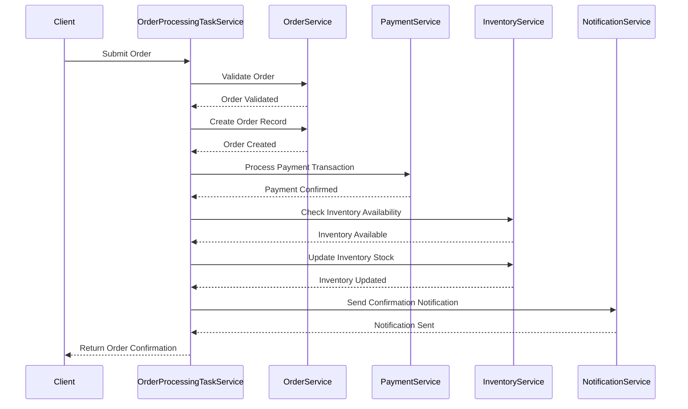

# Analysis and Design — Business Process Automation Solution

> **Goal**: Analyze a specific business process and design a service-oriented automation solution (SOA/Microservices).
> Scope: 4–6 week assignment — focus on **one business process**, not an entire system.

**References:**
1. *Service-Oriented Architecture: Analysis and Design for Services and Microservices* — Thomas Erl (2nd Edition)
2. *Microservices Patterns: With Examples in Java* — Chris Richardson
3. *Bài tập — Phát triển phần mềm hướng dịch vụ* — Hung Dang (available in Vietnamese)

---

## Part 1 — Analysis Preparation

### 1.1 Business Process Definition

Describe or diagram the high-level Business Process to be automated.

- **Domain**: E-commerce

- **Business Process**: Order Processing

- **Actors**: 

  - Customer
  - System
  - Warehouse Staff
  - Payment Gateway

- **Scope**: 

    ***In Scope:***
    - Customer submits an order
    - System validates and verifies order data
    - Calculate total order price
    - Process payment through payment gateway
    - Update inventory after successful payment
    - Persist order information in the system
    - Send order confirmation notification to customer
    - Provide API for order status retrieval

    ***Out of Scope:***
    - Physical shipping and delivery performed by warehouse staff or logistics providers
    - Return and refund processing after order completion
    - Advanced marketing and promotional campaign management
    - Business intelligence and analytical reporting
    - Physical warehouse operations beyond inventory quantity updates
    - Manual customer support and post-sale service activities

---

**Process Diagram:**

### 1.2 Existing Automation Systems

List existing systems, databases, or legacy logic related to this process.
**"None — the process is currently performed manually."**

| System Name | Type | Current Role | Interaction Method |
|-------------|------|--------------|-------------------|
|             |      |              |                   |

### 1.3 Non-Functional Requirements

Non-functional requirements serve as input for identifying Utility Service and Microservice Candidates in step 2.7.

| Requirement    | Description                                         |
|----------------|-----------------------------------------------------|
| Performance | API response time under 500ms for most requests; reminder notifications delivered within 1 minute of scheduled time |
| Scalability | Support up to 100 concurrent users; each microservice can be scaled independently if needed |
| Availability | 95% uptime during development and demo phases; basic error handling and service restart on failure |
| Security | JWT-based authentication, HTTPS for all API calls, role-based access control (patient/doctor/staff), basic input validation |
| Maintainability | Codebase separated by microservice with clear README per service; use of Git for version control and collaboration among 3 team members |
| Usability | Simple and intuitive UI requiring minimal technical knowledge for patients and doctors to navigate |
---

## Part 2 — REST/Microservices Modeling

# Part 2 — REST/Microservices Modeling

---

### 2.1 Decompose Business Process & 2.2 Filter Unsuitable Actions

Decompose the process from 1.1 into granular actions. Mark actions unsuitable for service encapsulation.

| # | Action | Actor | Description | Suitable? |
|---|--------|-------|-------------|-----------|
| 1 | Submit Order | Customer | Customer submits a purchase order with selected products and quantities | ✅ |
| 2 | Validate Order | System | Validate order details and verify submitted information | ✅ |
| 3 | Create Order Record | System | Persist initial order information into the order system | ✅ |
| 4 | Process Payment | Payment Gateway | Process payment transaction for the submitted order | ✅ |
| 5 | Confirm Payment | Payment Gateway | Return payment result and confirmation status | ✅ |
| 6 | Check Inventory | System | Verify product stock availability before fulfillment | ✅ |
| 7 | Update Inventory | System | Deduct purchased quantities from inventory stock | ✅ |
| 8 | Send Confirmation Notification | System | Notify customer that the order has been successfully processed | ✅ |
| 9 | Ship Order | Warehouse Staff | Physically package and deliver the order | ❌ |

Actions marked ❌ require manual physical execution and cannot be encapsulated as autonomous services.

---

### 2.3 Entity Service Candidates

Identify business entities and group reusable (agnostic) actions into Entity Service Candidates.

| Entity | Service Candidate | Agnostic Actions |
|--------|------------------|------------------|
| Order | Order Service | Validate Order, Create Order Record, Retrieve Order Details, Update Order Status |
| Payment | Payment Service | Process Payment Transaction, Confirm Payment Status, Retrieve Payment Information |
| Inventory | Inventory Service | Check Inventory Availability, Update Inventory Stock, Retrieve Inventory Status |
| Notification | Notification Service | Send Confirmation Notification, Send Payment Notification |

---

### 2.4 Task Service Candidate

Group process-specific (non-agnostic) actions into a Task Service Candidate.

| Non-agnostic Action | Task Service Candidate |
|--------------------|-----------------------|
| Coordinate end-to-end order processing workflow | Order Processing Task Service |

---

### 2.5 Identify Resources

Map entities/processes to REST URI Resources.

| Entity / Process | Resource URI |
|------------------|-------------|
| Order | /orders |
| Payment | /payments |
| Inventory | /inventory |
| Notification | /notifications |
| Order Processing Workflow | /order-processing |

---

### 2.6 Associate Capabilities with Resources and Methods

| Service Candidate | Capability | Resource | HTTP Method |
|------------------|-----------|----------|-------------|
| Order Service | Validate Order | /orders/validate | POST |
| Order Service | Create Order Record | /orders | POST |
| Order Service | Retrieve Order Details | /orders/{id} | GET |
| Order Service | Update Order Status | /orders/{id}/status | PUT |
| Payment Service | Process Payment Transaction | /payments | POST |
| Payment Service | Confirm Payment Status | /payments/{id}/confirm | GET |
| Inventory Service | Check Inventory Availability | /inventory/check | GET |
| Inventory Service | Update Inventory Stock | /inventory/{id} | PUT |
| Notification Service | Send Confirmation Notification | /notifications/order-confirmation | POST |
| Order Processing Task Service | Execute Order Processing Workflow | /order-processing | POST |

---

### 2.7 Utility Service & Microservice Candidates

Based on Non-Functional Requirements (1.3) and Processing Requirements, identify cross-cutting utility logic or logic requiring high autonomy/performance.

| Candidate | Type (Utility / Microservice) | Justification |
|----------|------------------------------|--------------|
| Notification Service | Utility Service | Cross-cutting reusable communication concern across business processes |
| Payment Service | Microservice | Requires enhanced security, independent scalability, and fault isolation |

---

### 2.8 Service Composition Candidates

Interaction diagram showing how Service Candidates collaborate to fulfill the business process.

## Part 3 — Service-Oriented Design

### 3.1 Uniform Contract Design

Service Contract specification for each service. Full OpenAPI specs:
- [`docs/api-specs/service-a.yaml`](api-specs/service-a.yaml)
- [`docs/api-specs/service-b.yaml`](api-specs/service-b.yaml)

**API Gateway:**

| Endpoint | Method | Media Type | Response Codes |
|----------|--------|------------|----------------|
| `/auth/register` | POST | application/json | 201, 400, 409 |
| `/auth/login` | POST | application/json | 200, 400, 401 |
| `/auth/logout` | POST | application/json | 200, 401 |
| `/patients` | GET | application/json | 200, 401, 403 |
| `/patients/{id}` | GET | application/json | 200, 401, 403, 404 |
| `/patients` | POST | application/json | 201, 400, 401, 403 |
| `/patients/{id}` | PUT | application/json | 200, 400, 401, 403, 404 |
| `/staff` | GET | application/json | 200, 401, 403 |
| `/staff/{id}` | GET | application/json | 200, 401, 403, 404 |
| `/staff/doctors` | POST | application/json | 201, 400, 401, 403 |
| `/staff/hospital-staff` | POST | application/json | 201, 400, 401, 403 |
| `/appointments` | GET | application/json | 200, 401, 403 |
| `/appointments/{id}` | GET | application/json | 200, 401, 403, 404 |
| `/appointments` | POST | application/json | 201, 400, 401, 403 |
| `/appointments/{id}` | PUT | application/json | 200, 400, 401, 403, 404 |
| `/appointments/{id}/report` | POST | application/json | 201, 400, 401, 403 |
| `/appointments/{id}/report` | GET | application/json | 200, 401, 403, 404 |
| `/medications` | GET | application/json | 200, 401, 403 |
| `/medications/{id}` | GET | application/json | 200, 401, 403, 404 |
| `/medications` | POST | application/json | 201, 400, 401, 403 |
| `/prescriptions` | POST | application/json | 201, 400, 401, 403 |
| `/prescriptions/{id}` | GET | application/json | 200, 401, 403, 404 |
| `/prescriptions/{id}/items` | POST | application/json | 201, 400, 401, 403 |
| `/prescriptions/{id}/items` | GET | application/json | 200, 401, 403, 404 |
| `/schedules` | GET | application/json | 200, 401, 403 |
| `/schedules/{id}/confirm` | PUT | application/json | 200, 401, 403, 404 |
| `/notifications/{recipientId}` | GET | application/json | 200, 401, 403 |
| `/notifications/{id}/read` | PUT | application/json | 200, 401, 403, 404 |

---

**Auth Service:**

| Endpoint | Method | Media Type | Response Codes |
|----------|--------|------------|----------------|
| `/auth/register` | POST | `application/json` | 201, 400, 409 |
| `/auth/login` | POST | `application/json` | 200, 400, 401 |
| `/auth/logout` | POST | `application/json` | 200, 401 |
| `rpc VerifyToken(VerifyTokenRequest)` | gRPC | `application/grpc+proto` | OK, UNAUTHENTICATED |

---

**Patient Service:**

| Endpoint | Method | Media Type | Response Codes |
|----------|--------|------------|----------------|
| `/patients` | GET | `application/json` | 200, 401, 403 |
| `/patients/{id}` | GET | `application/json` | 200, 401, 404 |
| `/patients` | POST | `application/json` | 201, 400, 401 |
| `/patients/{id}` | PUT | `application/json` | 200, 400, 401, 404 |
| `rpc GetPatient(GetPatientRequest)` | gRPC | `application/grpc+proto` | OK, NOT_FOUND |

---

**Staff Service:**

| Endpoint | Method | Media Type | Response Codes |
|----------|--------|------------|----------------|
| `/staff` | GET | `application/json` | 200, 401, 403 |
| `/staff/{id}` | GET | `application/json` | 200, 401, 404 |
| `/staff/doctors` | POST | `application/json` | 201, 400, 401 |
| `/staff/hospital-staff` | POST | `application/json` | 201, 400, 401 |
| `rpc GetStaff(GetStaffRequest)` | gRPC | `application/grpc+proto` | OK, NOT_FOUND |

---

**Appointment Service:**

| Endpoint | Method | Media Type | Response Codes |
|----------|--------|------------|----------------|
| `/appointments` | GET | `application/json` | 200, 401, 403 |
| `/appointments/{id}` | GET | `application/json` | 200, 401, 404 |
| `/appointments` | POST | `application/json` | 201, 400, 401 |
| `/appointments/{id}` | PUT | `application/json` | 200, 400, 401, 404 |
| `/appointments/{id}/report` | POST | `application/json` | 201, 400, 401, 404 |
| `/appointments/{id}/report` | GET | `application/json` | 200, 401, 404 |
| `rpc GetAppointment(GetAppointmentRequest)` | gRPC | `application/grpc+proto` | OK, NOT_FOUND |
| `appointment_report.created` (publish) | Kafka | `application/json` | — |

---

**Medication Service:**

| Endpoint | Method | Media Type | Response Codes |
|----------|--------|------------|----------------|
| `/medications` | GET | `application/json` | 200, 401 |
| `/medications/{id}` | GET | `application/json` | 200, 401, 404 |
| `/medications` | POST | `application/json` | 201, 400, 401 |
| `/prescriptions` | POST | `application/json` | 201, 400, 401 |
| `/prescriptions/{id}` | GET | `application/json` | 200, 401, 404 |
| `/prescriptions/{id}/items` | POST | `application/json` | 201, 400, 401, 404 |
| `/prescriptions/{id}/items` | GET | `application/json` | 200, 401, 404 |
| `/schedules` | GET | `application/json` | 200, 401 |
| `/schedules/{id}/confirm` | PUT | `application/json` | 200, 400, 401, 404 |
| `rpc GetMedicationSchedule(GetScheduleRequest)` | gRPC | `application/grpc+proto` | OK, NOT_FOUND |
| `appointment_report.created` (consume) | Kafka | `application/json` | — |
| `medication_schedule.due` (publish) | Kafka | `application/json` | — |
| `medication_schedule.missed` (publish) | Kafka | `application/json` | — |

---

**Notification Service:**

| Endpoint | Method | Media Type | Response Codes |
|----------|--------|------------|----------------|
| `/notifications/{recipientId}` | GET | `application/json` | 200, 401, 404 |
| `/notifications/{id}/read` | PUT | `application/json` | 200, 401, 404 |
| `rpc SendReminder(SendReminderRequest)` | gRPC | `application/grpc+proto` | OK, NOT_FOUND |
| `medication_schedule.due` (consume) | Kafka | `application/json` | — |
| `medication_schedule.missed` (consume) | Kafka | `application/json` | — |

---

### 3.2 Service Logic Design

Internal processing flow for each service.

**Authentication Service:**

**Patient Service:**

**Staff Service:**

**Appointment Service:**

**Medication Service:**

**Notification Service:**

---

