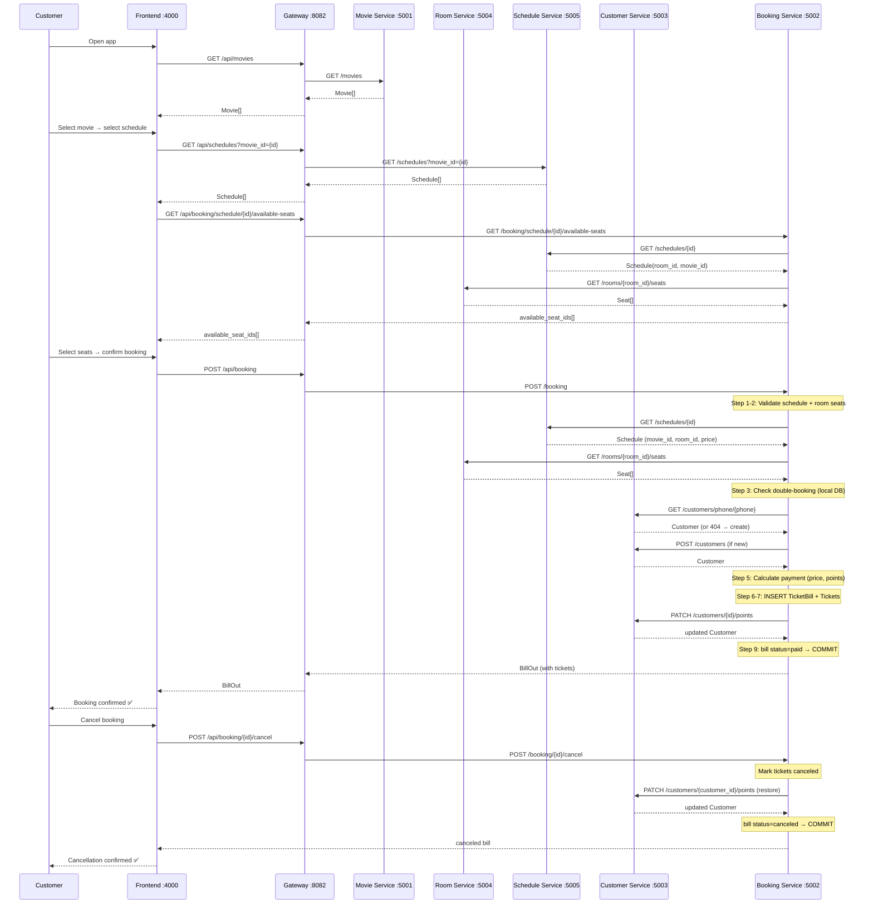
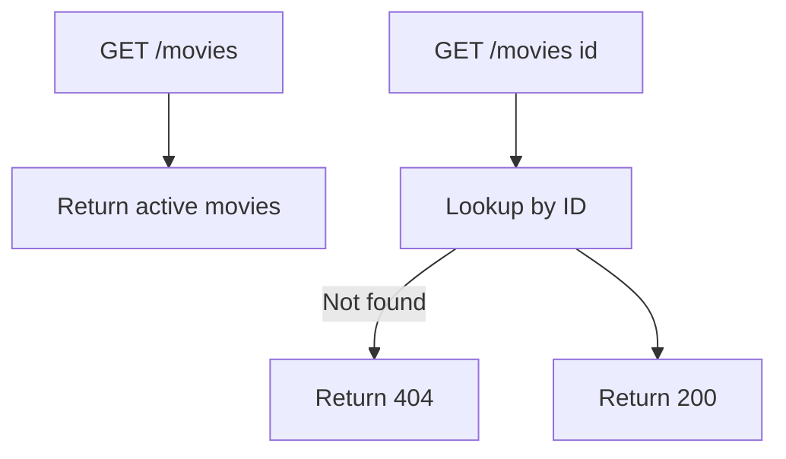
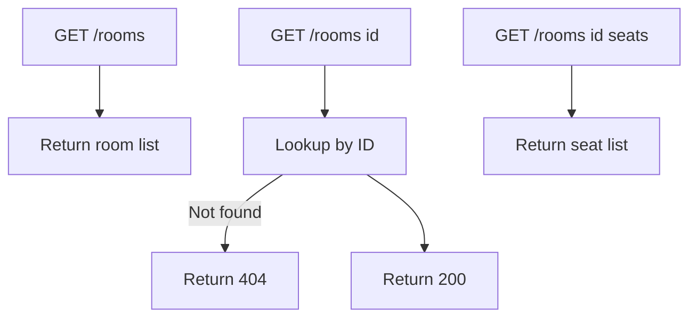
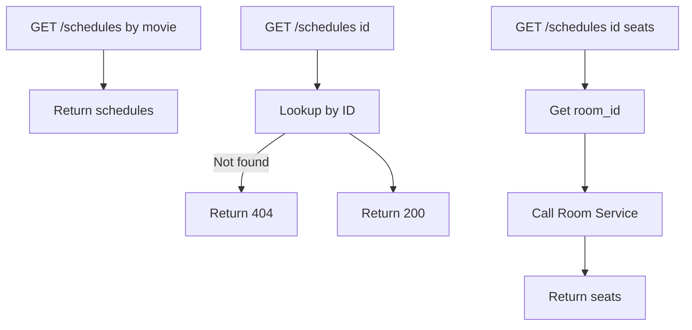
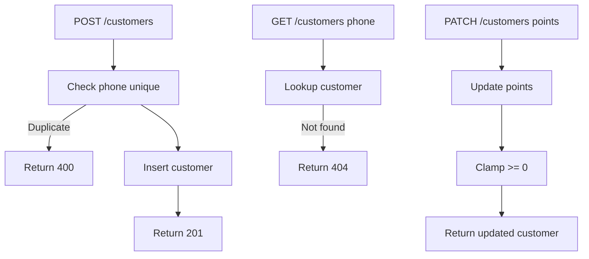
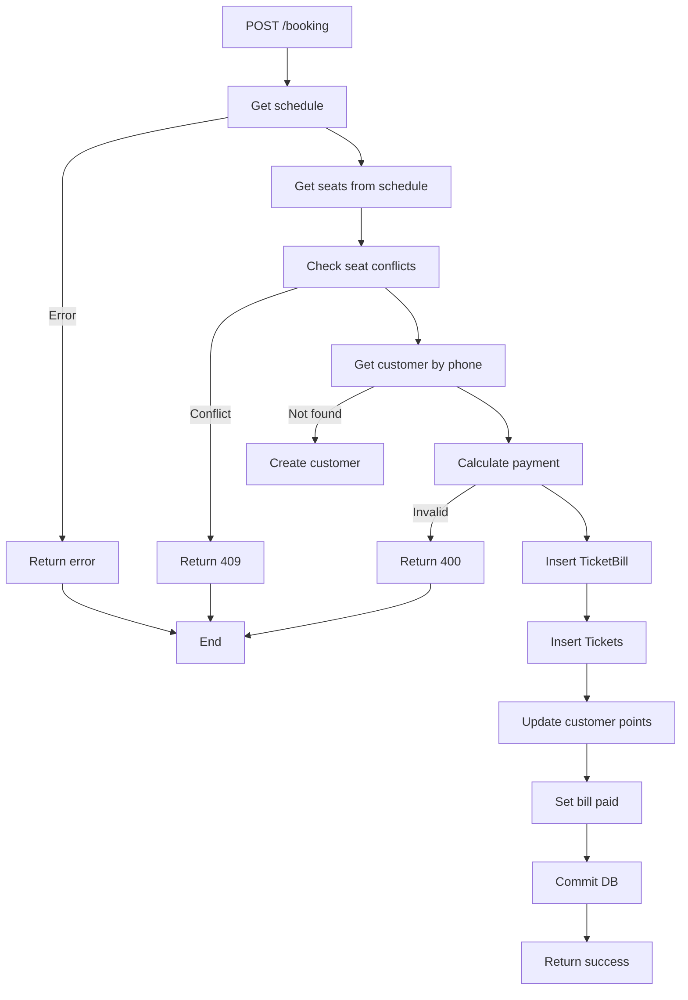
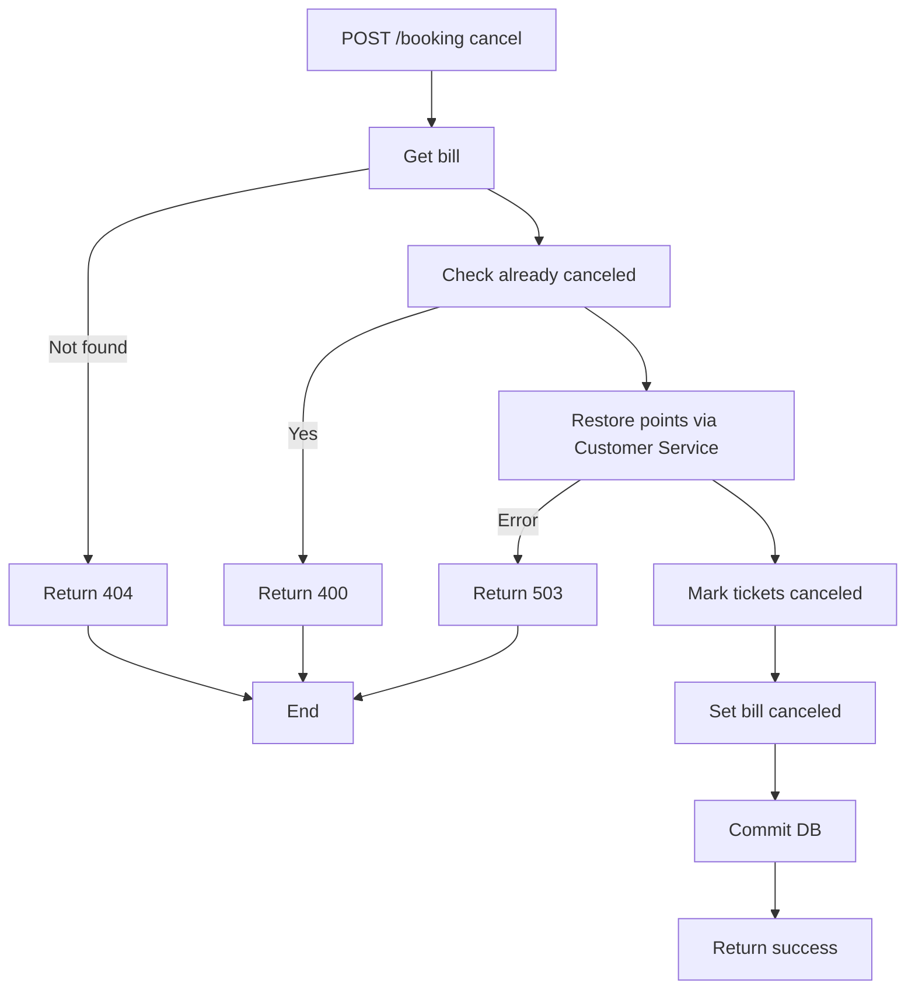

# Analysis and Design — Movie Ticket Booking System

> **Goal**: Analyze a specific business process and design a service-oriented automation solution (SOA/Microservices).
> Scope: 4–6 week assignment — focus on **one business process**, not an entire system.
>
> **Target decomposition**: 5 microservices — **Movie, Room, Schedule, Customer, Booking**.

**References:**
1. *Service-Oriented Architecture: Analysis and Design for Services and Microservices* — Thomas Erl (2nd Edition)
2. *Microservices Patterns: With Examples in Java* — Chris Richardson
3. *Bài tập — Phát triển phần mềm hướng dịch vụ* — Hung Dang (available in Vietnamese)

---

## Part 1 — Analysis Preparation

### 1.1 Business Process Definition

Describe or diagram the high-level Business Process to be automated.

- **Domain**: Entertainment / Cinema

- **Business Process**: Movie Ticket Booking

- **Actors**:

  - Customers

- **Scope**:

    ***In Scope:***
    - Browsing movies and available screening schedules
    - Viewing seat availability for a specific schedule
    - Booking one or more seats for a schedule (with loyalty point discount)
    - Automatic creation of ticket bill and tickets after successful booking
    - Canceling a booking and restoring used loyalty points

    ***Out of Scope:***
    - Online payment gateway integration (e.g., VNPay, Momo)
    - Email or SMS notification to customers
    - Customer account registration with password
    - Reporting and analytics dashboard
    - Multi-cinema / multi-branch support
    - Staff management of movies, rooms, seats, and schedules
    - Staff check-in of tickets at the cinema entrance
    - Staff authentication

---

**Process Diagram:**

### 1.2 Existing Automation Systems

**"None — the process is currently performed manually."**

| System Name | Type | Current Role | Interaction Method |
|-------------|------|--------------|-------------------|
| None | — | — | — |

### 1.3 Non-Functional Requirements

Non-functional requirements serve as input for identifying Utility Service and Microservice Candidates in step 2.7.

| Requirement | Description |
|-------------|-------------|
| Performance | API response time under 500ms for most requests; booking transaction completes within 1 second |
| Scalability | Each microservice can be scaled independently; supports concurrent seat booking without double-booking |
| Availability | Services restart automatically on failure; health check endpoint on every service |
| Security | Input validation on all endpoints; shared secret between services for internal calls |
| Maintainability | Codebase separated by microservice with clear README per service; Git version control |
| Usability | Simple SPA interface requiring no technical knowledge for customers to browse and book tickets |

---

## Part 2 — REST/Microservices Modeling

### 2.1 Decompose Business Process & 2.2 Filter Unsuitable Actions

Decompose the process from 1.1 into granular actions. Mark actions unsuitable for service encapsulation.

| # | Action | Actor | Description | Suitable? |
|---|--------|-------|-------------|-----------|
| 1 | Browse movies | Customer | Customer views list of currently showing movies | ✅ |
| 2 | View schedules | Customer | Customer views available showtimes for a selected movie | ✅ |
| 3 | View seat map | Customer | Customer views available/booked seats for a schedule | ✅ |
| 4 | Select seats | Customer | Customer selects one or more available seats | ✅ |
| 5 | Enter booking info | Customer | Customer enters phone number, name, and loyalty points to use | ✅ |
| 6 | Validate movie, schedule & seats | System | System verifies schedule exists, seats belong to the correct room, and movie-room mapping is valid | ✅ |
| 7 | Check seat availability | System | System checks no active ticket exists for the same schedule + seat | ✅ |
| 8 | Calculate payment | System | System computes total, discount from points, paid amount, change | ✅ |
| 9 | Create ticket bill | System | System creates a TicketBill record (pending → paid) | ✅ |
| 10 | Create tickets | System | System creates one Ticket per selected seat linked to the bill | ✅ |
| 11 | Award loyalty points | System | System deducts used points and awards earned points to customer | ✅ |
| 12 | Cancel booking | Customer | Customer requests cancellation of a booking | ✅ |
| 13 | Restore points on cancel | System | System restores used points and removes earned points (compensation) | ✅ |

> Actions marked ❌: manual-only, require human interaction, or are pure UI state — cannot be encapsulated as a service.

---

### 2.3 Entity Service Candidates

Identify business entities and group reusable (agnostic) actions into Entity Service Candidates.

| Entity | Service Candidate | Agnostic Actions |
|--------|-------------------|------------------|
| Movie | Movie Service | Get all movies, get movie by ID |
| Room | Room Service | Get all rooms, get room by ID |
| Seat | Room Service | Get seats by room, get seat by ID |
| Schedule | Schedule Service | Get all schedules (filter by movie), get schedule by ID, get seats for schedule |
| Customer | Customer Service | Register customer, get customer by ID, get customer by phone number |
| LoyaltyPoints | Customer Service | Deduct points, award points, get point balance |
| TicketBill | Booking Service | Get bill by ID, get all bills for customer |
| Ticket | Booking Service | Get ticket by ID |

---

### 2.4 Task Service Candidate

Group process-specific (non-agnostic) actions into Task Service Candidates.

| Non-agnostic Action | Task Service Candidate |
|---------------------|------------------------|
| Validate movie + schedule + seats → check availability → create bill + tickets → process points → commit | **Booking Saga** — `POST /booking` in Booking Service; orchestrates cross-service validation (Schedule Service + Room Service + Customer Service) and local DB writes atomically |
| Cancel booking: mark tickets canceled + restore loyalty points (compensating transaction) | **Cancel Saga** — `POST /booking/{id}/cancel` in Booking Service; compensates the booking saga by calling Customer Service to restore points |

---

### 2.5 Identify Resources

Map entities/processes to REST URI Resources.

| Entity / Process | Resource URI | Service |
|------------------|--------------|---------|
| Health check | `/health` | All services |
| Movie list | `/movies` | Movie Service |
| Movie detail | `/movies/{id}` | Movie Service |
| Room list | `/rooms` | Room Service |
| Room detail | `/rooms/{id}` | Room Service |
| Seats in room | `/rooms/{id}/seats` | Room Service |
| Schedule list | `/schedules` | Schedule Service |
| Schedule detail | `/schedules/{id}` | Schedule Service |
| Seats for schedule | `/schedules/{id}/seats` | Schedule Service |
| Customer register | `/customers` | Customer Service |
| Customer by ID | `/customers/{id}` | Customer Service |
| Customer by phone | `/customers/phone/{phone}` | Customer Service |
| Update customer points | `/customers/{id}/points` | Customer Service |
| Book tickets (Saga) | `/booking` | Booking Service |
| Cancel booking | `/booking/{id}/cancel` | Booking Service |
| Available seats | `/booking/schedule/{id}/available-seats` | Booking Service |
| Bill detail | `/bills/{id}` | Booking Service |
| Bills by customer | `/bills/customer/{id}` | Booking Service |
| Ticket detail | `/tickets/{id}` | Booking Service |

---

### 2.6 Associate Capabilities with Resources and Methods

| Service Candidate | Capability | Resource | Protocol | HTTP Method | Response Codes |
|-------------------|------------|----------|----------|-------------|----------------|
| **API Gateway** | Route & forward all client requests | All `/api/*` routes | REST (proxy) | — | — |
| Movie Service | Health check | `/health` | REST | GET | 200 |
| Movie Service | List movies | `/movies` | REST | GET | 200 |
| Movie Service | Get movie | `/movies/{id}` | REST | GET | 200, 404 |
| Room Service | Health check | `/health` | REST | GET | 200 |
| Room Service | List rooms | `/rooms` | REST | GET | 200 |
| Room Service | Get room | `/rooms/{id}` | REST | GET | 200, 404 |
| Room Service | List seats in room | `/rooms/{id}/seats` | REST | GET | 200, 404 |
| Schedule Service | Health check | `/health` | REST | GET | 200 |
| Schedule Service | List schedules | `/schedules` | REST | GET | 200 |
| Schedule Service | Get schedule | `/schedules/{id}` | REST | GET | 200, 404 |
| Schedule Service | Get seats for schedule | `/schedules/{id}/seats` | REST | GET | 200, 404 |
| Customer Service | Health check | `/health` | REST | GET | 200 |
| Customer Service | Register customer | `/customers` | REST | POST | 201, 400 |
| Customer Service | Get customer by ID | `/customers/{id}` | REST | GET | 200, 404 |
| Customer Service | Get customer by phone | `/customers/phone/{phone}` | REST | GET | 200, 404 |
| Customer Service | Update loyalty points | `/customers/{id}/points` | REST | PATCH | 200, 400, 404 |
| Booking Service | Health check | `/health` | REST | GET | 200 |
| Booking Service | **Book tickets (Saga)** | `/booking` | REST | POST | 201, 400, 409, 503 |
| Booking Service | **Cancel booking (Compensation)** | `/booking/{id}/cancel` | REST | POST | 200, 400, 404 |
| Booking Service | Available seats | `/booking/schedule/{id}/available-seats` | REST | GET | 200, 503 |
| Booking Service | Get bill | `/bills/{id}` | REST | GET | 200, 404 |
| Booking Service | Get bills by customer | `/bills/customer/{id}` | REST | GET | 200 |
| Booking Service | Get ticket | `/tickets/{id}` | REST | GET | 200, 404 |

---

### 2.7 Utility Service & Microservice Candidates

Based on Non-Functional Requirements (1.3) and Processing Requirements, identify cross-cutting utility logic or logic requiring high autonomy/performance.

| Candidate | Type | Justification |
|-----------|------|---------------|
| API Gateway (Nginx) | Utility Service | Cross-cutting concern: single entry point for all client requests — handles routing and CORS; decouples frontend from internal service topology |
| Movie Service | Entity Service | Manages the movie catalog domain; independent lifecycle and simple read operations exposed to customers |
| Room Service | Entity Service | Owns screening rooms and seats; can scale independently from schedules and booking traffic |
| Schedule Service | Entity Service | Owns showtime lifecycle; isolated bounded context with high read volume from customers |
| Customer Service | Entity Service | Owns customer profile and loyalty point balance; called by Booking Service during saga |
| Booking Service | Task Service | High autonomy — orchestrates the booking saga spanning multiple services; owns transactional data (bills, tickets); handles compensating transactions on cancel |

---

### 2.8 Service Composition Candidates

Interaction diagram showing how Service Candidates collaborate to fulfill the business process.

---

## Part 3 — Service-Oriented Design

### 3.1 Uniform Contract Design

Service Contract specification for each service. Full OpenAPI specs:
- [`docs/api-specs/service-movie.yaml`](api-specs/service-movie.yaml) — Movie Service
- [`docs/api-specs/service-room.yaml`](api-specs/service-room.yaml) — Room Service
- [`docs/api-specs/service-schedule.yaml`](api-specs/service-schedule.yaml) — Schedule Service
- [`docs/api-specs/service-customer.yaml`](api-specs/service-customer.yaml) — Customer Service
- [`docs/api-specs/service-booking.yaml`](api-specs/service-booking.yaml) — Booking Service

**API Gateway (Nginx :8082):**

| Endpoint | Method | Media Type | Response Codes |
|----------|--------|------------|----------------|
| `/api/movies` | GET | application/json | 200 |
| `/api/movies/{id}` | GET | application/json | 200, 404 |
| `/api/rooms` | GET | application/json | 200 |
| `/api/rooms/{id}` | GET | application/json | 200, 404 |
| `/api/rooms/{id}/seats` | GET | application/json | 200, 404 |
| `/api/schedules` | GET | application/json | 200 |
| `/api/schedules/{id}` | GET | application/json | 200, 404 |
| `/api/schedules/{id}/seats` | GET | application/json | 200, 404 |
| `/api/customers` | POST | application/json | 201, 400 |
| `/api/customers/{id}` | GET | application/json | 200, 404 |
| `/api/customers/phone/{phone}` | GET | application/json | 200, 404 |
| `/api/customers/{id}/points` | PATCH | application/json | 200, 400, 404 |
| `/api/booking` | POST | application/json | 201, 400, 409, 503 |
| `/api/booking/{id}/cancel` | POST | application/json | 200, 400, 404 |
| `/api/booking/schedule/{id}/available-seats` | GET | application/json | 200, 503 |
| `/api/bills/{id}` | GET | application/json | 200, 404 |
| `/api/bills/customer/{id}` | GET | application/json | 200 |
| `/api/tickets/{id}` | GET | application/json | 200, 404 |

---

**Movie Service (FastAPI :5001):**

| Endpoint | Method | Media Type | Response Codes |
|----------|--------|------------|----------------|
| `/health` | GET | `application/json` | 200 |
| `/movies` | GET | `application/json` | 200 |
| `/movies/{id}` | GET | `application/json` | 200, 404 |

---

**Room Service (FastAPI :5004):**

| Endpoint | Method | Media Type | Response Codes |
|----------|--------|------------|----------------|
| `/health` | GET | `application/json` | 200 |
| `/rooms` | GET | `application/json` | 200 |
| `/rooms/{id}` | GET | `application/json` | 200, 404 |
| `/rooms/{id}/seats` | GET | `application/json` | 200, 404 |

---

**Schedule Service (FastAPI :5005):**

| Endpoint | Method | Media Type | Response Codes |
|----------|--------|------------|----------------|
| `/health` | GET | `application/json` | 200 |
| `/schedules` | GET | `application/json` | 200 |
| `/schedules/{id}` | GET | `application/json` | 200, 404 |
| `/schedules/{id}/seats` | GET | `application/json` | 200, 404 |

---

**Customer Service (FastAPI :5003):**

| Endpoint | Method | Media Type | Response Codes |
|----------|--------|------------|----------------|
| `/health` | GET | `application/json` | 200 |
| `/customers` | POST | `application/json` | 201, 400 |
| `/customers/{id}` | GET | `application/json` | 200, 404 |
| `/customers/phone/{phone}` | GET | `application/json` | 200, 404 |
| `/customers/{id}/points` | PATCH | `application/json` | 200, 400, 404 |

---

**Booking Service (FastAPI :5002):**

| Endpoint | Method | Media Type | Response Codes |
|----------|--------|------------|----------------|
| `/health` | GET | `application/json` | 200 |
| `/booking` | POST | `application/json` | 201, 400, 409, 503 |
| `/booking/{id}/cancel` | POST | `application/json` | 200, 400, 404 |
| `/booking/schedule/{id}/available-seats` | GET | `application/json` | 200, 503 |
| `/bills/{id}` | GET | `application/json` | 200, 404 |
| `/bills/customer/{id}` | GET | `application/json` | 200 |
| `/tickets/{id}` | GET | `application/json` | 200, 404 |

---

### 3.2 Service Logic Design

## Movie Service — Logic

## Room Service — Logic

## Schedule Service — Logic

## Customer Service — Logic

## Booking Service — Booking Saga Flow

## Booking Service — Cancel Saga (Compensation)

