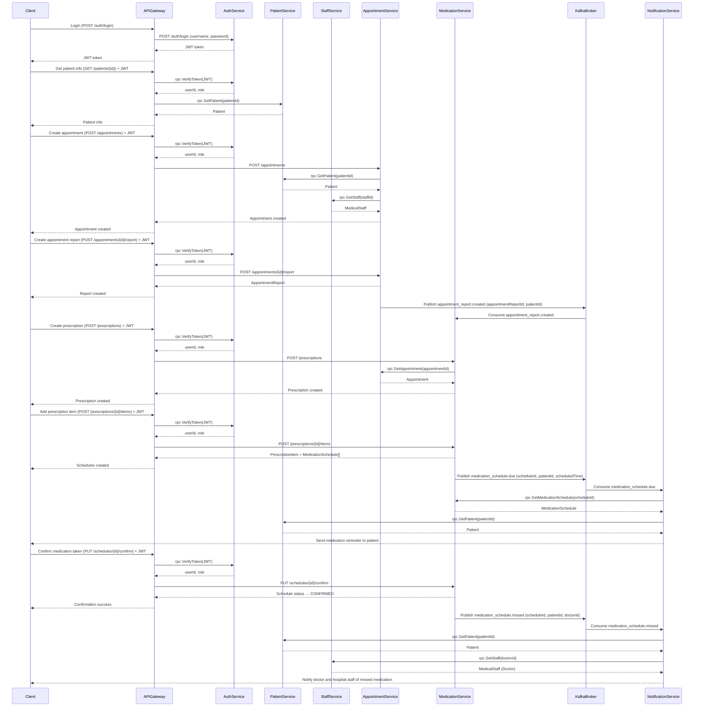

# Analysis and Design — Business Process Automation Solution

> **Goal**: Analyze a specific business process and design a service-oriented automation solution (SOA/Microservices).
> Scope: 4–6 week assignment — focus on **one business process**, not an entire system.

**References:**
1. *Service-Oriented Architecture: Analysis and Design for Services and Microservices* — Thomas Erl (2nd Edition)
2. *Microservices Patterns: With Examples in Java* — Chris Richardson
3. *Bài tập — Phát triển phần mềm hướng dịch vụ* — Hung Dang (available in Vietnamese)

---

## Part 1 — Analysis Preparation

### 1.1 Business Process Definition

Describe or diagram the high-level Business Process to be automated.

- **Domain**: E-commerce

- **Business Process**: Order Processing

- **Actors**: 

  - Customer
  - System
  - Warehouse Staff
  - Payment Gateway

- **Scope**: 

    ***In Scope:***
    - Customer submits an order
    - System validates and verifies order data
    - Calculate total order price
    - Process payment through payment gateway
    - Update inventory after successful payment
    - Persist order information in the system
    - Send order confirmation notification to customer
    - Provide API for order status retrieval

    ***Out of Scope:***
    - Physical shipping and delivery performed by warehouse staff or logistics providers
    - Return and refund processing after order completion
    - Advanced marketing and promotional campaign management
    - Business intelligence and analytical reporting
    - Physical warehouse operations beyond inventory quantity updates
    - Manual customer support and post-sale service activities

---

**Process Diagram:**

### 1.2 Existing Automation Systems

List existing systems, databases, or legacy logic related to this process.
**"None — the process is currently performed manually."**

| System Name | Type | Current Role | Interaction Method |
|-------------|------|--------------|-------------------|
|             |      |              |                   |

### 1.3 Non-Functional Requirements

Non-functional requirements serve as input for identifying Utility Service and Microservice Candidates in step 2.7.

| Requirement    | Description                                         |
|----------------|-----------------------------------------------------|
| Performance | API response time under 500ms for most requests; reminder notifications delivered within 1 minute of scheduled time |
| Scalability | Support up to 100 concurrent users; each microservice can be scaled independently if needed |
| Availability | 95% uptime during development and demo phases; basic error handling and service restart on failure |
| Security | JWT-based authentication, HTTPS for all API calls, role-based access control (patient/doctor/staff), basic input validation |
| Maintainability | Codebase separated by microservice with clear README per service; use of Git for version control and collaboration among 3 team members |
| Usability | Simple and intuitive UI requiring minimal technical knowledge for patients and doctors to navigate |
---

## Part 2 — REST/Microservices Modeling

### 2.1 Decompose Business Process & 2.2 Filter Unsuitable Actions

Decompose the process from 1.1 into granular actions. Mark actions unsuitable for service encapsulation.

| # | Action | Actor | Description | Suitable? |
|---|--------|-------|-------------|-----------|
| 1 | Submit order | Customer | Customer submits a purchase order with selected products and quantities | ✅ |
| 2 | Validate order | System | Validate order details, customer information, and product availability | ✅ |
| 3 | Calculate total price | System | Calculate total payable amount for the order including all applicable charges | ✅ |
| 4 | Process payment | System / Payment Gateway | Submit payment transaction to payment gateway for authorization and processing | ✅ |
| 5 | Confirm payment | Payment Gateway | Return payment confirmation and transaction result to the system | ✅ |
| 6 | Update inventory | System | Deduct purchased product quantities from inventory stock | ✅ |
| 7 | Save order record | System | Persist finalized order details into order database | ✅ |
| 8 | Send confirmation notification | Notification Service | Send order confirmation notification to customer | ✅ |
| 9 | Ship order | Warehouse Staff | Physically package and deliver order to customer | ❌ |
---

### 2.3 Entity Service Candidates

Identify business entities and group reusable (agnostic) actions into Entity Service Candidates.

| Entity | Service Candidate | Agnostic Actions |
|--------|------------------|------------------|
| Order | Order Service | Create Order Record, Retrieve Order Details, Update Order Status |
| Payment | Payment Service | Process Payment Transaction, Confirm Payment Status, Retrieve Payment Details |
| Inventory | Inventory Service | Check Product Availability, Update Inventory Stock, Retrieve Inventory Status |
| Notification | Notification Service | Send Order Confirmation Notification, Send Payment Notification |

---

### 2.4 Task Service Candidate

Group process-specific (non-agnostic) actions into Task Service Candidates.

| Non-agnostic Action | Task Service Candidate |
|---------------------|------------------------|
| Generate medication reminder schedules from prescription items after appointment report is created | **MedicationScheduleTask Service** — triggered via Kafka: `appointment_report.created` |
| Trigger medication reminder at exact scheduled time for a specific patient | **ReminderTrigger Task Service** — triggered via Kafka: `medication_schedule.due` |
| Detect missed medication and alert doctor + hospital staff when patient does not confirm within time window | **MissedMedicationAlert Task Service** — triggered via Kafka: `medication_schedule.missed` |

---

### 2.5 Identify Resources

Map entities/processes to REST URI Resources.

| Entity / Process | Resource URI |
|------------------|--------------|
| User registration | `/auth/register` |
| User login | `/auth/login` |
| User logout | `/auth/logout` |
| Patient list | `/patients` |
| Patient profile | `/patients/{id}` |
| Staff list | `/staff` |
| Staff profile | `/staff/{id}` |
| Doctor profile (create) | `/staff/doctors` |
| Hospital staff profile (create) | `/staff/hospital-staff` |
| Appointment list | `/appointments` |
| Appointment detail | `/appointments/{id}` |
| Appointment report | `/appointments/{id}/report` |
| Medication list | `/medications` |
| Medication detail | `/medications/{id}` |
| Prescription list | `/prescriptions` |
| Prescription detail | `/prescriptions/{id}` |
| Prescription items | `/prescriptions/{id}/items` |
| Medication schedule list | `/schedules` |
| Medication schedule confirm | `/schedules/{id}/confirm` |
| Notification list by recipient | `/notifications/{recipientId}` |
| Notification read status | `/notifications/{id}/read` |

---

### 2.6 Associate Capabilities with Resources and Methods

| Service Candidate | Capability | Resource / RPC / Topic | Protocol | HTTP Method |
|-------------------|------------|------------------------|----------|-------------|
| **API Gateway** | Route & forward all client requests | All `/` routes | REST (proxy) | — |
| **API Gateway** | Forward JWT token for verification | `rpc VerifyToken(VerifyTokenRequest)` | gRPC (call to Auth Service) | — |
| Auth Service | Register user | `/auth/register` | REST | POST |
| Auth Service | Login | `/auth/login` | REST | POST |
| Auth Service | Logout | `/auth/logout` | REST | POST |
| Auth Service | Verify token (internal) | `rpc VerifyToken(VerifyTokenRequest)` | gRPC | — |
| Patient Service | Get all patients | `/patients` | REST | GET |
| Patient Service | Get patient by ID | `/patients/{id}` | REST | GET |
| Patient Service | Create patient profile | `/patients` | REST | POST |
| Patient Service | Update patient profile | `/patients/{id}` | REST | PUT |
| Patient Service | Get patient (internal) | `rpc GetPatient(GetPatientRequest)` | gRPC | — |
| Staff Service | Get all staff | `/staff` | REST | GET |
| Staff Service | Get staff by ID | `/staff/{id}` | REST | GET |
| Staff Service | Create doctor profile | `/staff/doctors` | REST | POST |
| Staff Service | Create hospital staff profile | `/staff/hospital-staff` | REST | POST |
| Staff Service | Get staff (internal) | `rpc GetStaff(GetStaffRequest)` | gRPC | — |
| Appointment Service | Get all appointments | `/appointments` | REST | GET |
| Appointment Service | Get appointment by ID | `/appointments/{id}` | REST | GET |
| Appointment Service | Create appointment | `/appointments` | REST | POST |
| Appointment Service | Update appointment | `/appointments/{id}` | REST | PUT |
| Appointment Service | Create appointment report | `/appointments/{id}/report` | REST | POST |
| Appointment Service | Get appointment report | `/appointments/{id}/report` | REST | GET |
| Appointment Service | Get appointment (internal) | `rpc GetAppointment(GetAppointmentRequest)` | gRPC | — |
| Appointment Service | Publish appointment report created | `appointment_report.created` | Kafka (publish) | — |
| Medication Service | Get all medications | `/medications` | REST | GET |
| Medication Service | Get medication by ID | `/medications/{id}` | REST | GET |
| Medication Service | Create medication | `/medications` | REST | POST |
| Medication Service | Create prescription | `/prescriptions` | REST | POST |
| Medication Service | Get prescription by ID | `/prescriptions/{id}` | REST | GET |
| Medication Service | Add prescription item | `/prescriptions/{id}/items` | REST | POST |
| Medication Service | Get prescription items | `/prescriptions/{id}/items` | REST | GET |
| Medication Service | Get medication schedules | `/schedules` | REST | GET |
| Medication Service | Confirm medication schedule | `/schedules/{id}/confirm` | REST | PUT |
| Medication Service | Get schedule (internal) | `rpc GetMedicationSchedule(GetScheduleRequest)` | gRPC | — |
| Medication Service | Consume appointment report created | `appointment_report.created` | Kafka (consume) | — |
| Medication Service | Publish schedule due | `medication_schedule.due` | Kafka (publish) | — |
| Medication Service | Publish schedule missed | `medication_schedule.missed` | Kafka (publish) | — |
| Notification Service | Get notifications by recipient | `/notifications/{recipientId}` | REST | GET |
| Notification Service | Mark notification as read | `/notifications/{id}/read` | REST | PUT |
| Notification Service | Send reminder (internal) | `rpc SendReminder(SendReminderRequest)` | gRPC | — |
| Notification Service | Consume schedule due | `medication_schedule.due` | Kafka (consume) | — |
| Notification Service | Consume schedule missed | `medication_schedule.missed` | Kafka (consume) | — |

---

### 2.7 Utility Service & Microservice Candidates

Based on Non-Functional Requirements (1.3) and Processing Requirements, identify cross-cutting utility logic or logic requiring high autonomy/performance.

| Candidate | Type (Utility / Microservice) | Justification |
|-----------|-------------------------------|---------------|
| Auth Service | Utility Service | Cross-cutting concern: API Gateway calls `rpc VerifyToken` to authenticate every incoming request before routing to any downstream service; shared across the entire system |
| API Gateway | Utility Service | Cross-cutting concern: single entry point for all client requests — handles routing, JWT forwarding to Auth Service, and load balancing; decouples clients from internal service topology |
| Kafka Broker | Microservice | Asynchronous, high-performance event bus — decouples Appointment Service, Medication Service, and Notification Service; handles high-volume schedule trigger events (`appointment_report.created`, `medication_schedule.due`, `medication_schedule.missed`) without blocking the main business flow |
| Notification Service | Microservice | High autonomy — supports multiple delivery channels (push notification, SMS, email); operates independently from the main business flow; triggered entirely by Kafka events; alerts both patients and doctors/hospital staff |

---

### 2.8 Service Composition Candidates

Interaction diagram showing how Service Candidates collaborate to fulfill the business process.

## Part 3 — Service-Oriented Design

### 3.1 Uniform Contract Design

Service Contract specification for each service. Full OpenAPI specs:
- [`docs/api-specs/service-a.yaml`](api-specs/service-a.yaml)
- [`docs/api-specs/service-b.yaml`](api-specs/service-b.yaml)

**API Gateway:**

| Endpoint | Method | Media Type | Response Codes |
|----------|--------|------------|----------------|
| `/auth/register` | POST | application/json | 201, 400, 409 |
| `/auth/login` | POST | application/json | 200, 400, 401 |
| `/auth/logout` | POST | application/json | 200, 401 |
| `/patients` | GET | application/json | 200, 401, 403 |
| `/patients/{id}` | GET | application/json | 200, 401, 403, 404 |
| `/patients` | POST | application/json | 201, 400, 401, 403 |
| `/patients/{id}` | PUT | application/json | 200, 400, 401, 403, 404 |
| `/staff` | GET | application/json | 200, 401, 403 |
| `/staff/{id}` | GET | application/json | 200, 401, 403, 404 |
| `/staff/doctors` | POST | application/json | 201, 400, 401, 403 |
| `/staff/hospital-staff` | POST | application/json | 201, 400, 401, 403 |
| `/appointments` | GET | application/json | 200, 401, 403 |
| `/appointments/{id}` | GET | application/json | 200, 401, 403, 404 |
| `/appointments` | POST | application/json | 201, 400, 401, 403 |
| `/appointments/{id}` | PUT | application/json | 200, 400, 401, 403, 404 |
| `/appointments/{id}/report` | POST | application/json | 201, 400, 401, 403 |
| `/appointments/{id}/report` | GET | application/json | 200, 401, 403, 404 |
| `/medications` | GET | application/json | 200, 401, 403 |
| `/medications/{id}` | GET | application/json | 200, 401, 403, 404 |
| `/medications` | POST | application/json | 201, 400, 401, 403 |
| `/prescriptions` | POST | application/json | 201, 400, 401, 403 |
| `/prescriptions/{id}` | GET | application/json | 200, 401, 403, 404 |
| `/prescriptions/{id}/items` | POST | application/json | 201, 400, 401, 403 |
| `/prescriptions/{id}/items` | GET | application/json | 200, 401, 403, 404 |
| `/schedules` | GET | application/json | 200, 401, 403 |
| `/schedules/{id}/confirm` | PUT | application/json | 200, 401, 403, 404 |
| `/notifications/{recipientId}` | GET | application/json | 200, 401, 403 |
| `/notifications/{id}/read` | PUT | application/json | 200, 401, 403, 404 |

---

**Auth Service:**

| Endpoint | Method | Media Type | Response Codes |
|----------|--------|------------|----------------|
| `/auth/register` | POST | `application/json` | 201, 400, 409 |
| `/auth/login` | POST | `application/json` | 200, 400, 401 |
| `/auth/logout` | POST | `application/json` | 200, 401 |
| `rpc VerifyToken(VerifyTokenRequest)` | gRPC | `application/grpc+proto` | OK, UNAUTHENTICATED |

---

**Patient Service:**

| Endpoint | Method | Media Type | Response Codes |
|----------|--------|------------|----------------|
| `/patients` | GET | `application/json` | 200, 401, 403 |
| `/patients/{id}` | GET | `application/json` | 200, 401, 404 |
| `/patients` | POST | `application/json` | 201, 400, 401 |
| `/patients/{id}` | PUT | `application/json` | 200, 400, 401, 404 |
| `rpc GetPatient(GetPatientRequest)` | gRPC | `application/grpc+proto` | OK, NOT_FOUND |

---

**Staff Service:**

| Endpoint | Method | Media Type | Response Codes |
|----------|--------|------------|----------------|
| `/staff` | GET | `application/json` | 200, 401, 403 |
| `/staff/{id}` | GET | `application/json` | 200, 401, 404 |
| `/staff/doctors` | POST | `application/json` | 201, 400, 401 |
| `/staff/hospital-staff` | POST | `application/json` | 201, 400, 401 |
| `rpc GetStaff(GetStaffRequest)` | gRPC | `application/grpc+proto` | OK, NOT_FOUND |

---

**Appointment Service:**

| Endpoint | Method | Media Type | Response Codes |
|----------|--------|------------|----------------|
| `/appointments` | GET | `application/json` | 200, 401, 403 |
| `/appointments/{id}` | GET | `application/json` | 200, 401, 404 |
| `/appointments` | POST | `application/json` | 201, 400, 401 |
| `/appointments/{id}` | PUT | `application/json` | 200, 400, 401, 404 |
| `/appointments/{id}/report` | POST | `application/json` | 201, 400, 401, 404 |
| `/appointments/{id}/report` | GET | `application/json` | 200, 401, 404 |
| `rpc GetAppointment(GetAppointmentRequest)` | gRPC | `application/grpc+proto` | OK, NOT_FOUND |
| `appointment_report.created` (publish) | Kafka | `application/json` | — |

---

**Medication Service:**

| Endpoint | Method | Media Type | Response Codes |
|----------|--------|------------|----------------|
| `/medications` | GET | `application/json` | 200, 401 |
| `/medications/{id}` | GET | `application/json` | 200, 401, 404 |
| `/medications` | POST | `application/json` | 201, 400, 401 |
| `/prescriptions` | POST | `application/json` | 201, 400, 401 |
| `/prescriptions/{id}` | GET | `application/json` | 200, 401, 404 |
| `/prescriptions/{id}/items` | POST | `application/json` | 201, 400, 401, 404 |
| `/prescriptions/{id}/items` | GET | `application/json` | 200, 401, 404 |
| `/schedules` | GET | `application/json` | 200, 401 |
| `/schedules/{id}/confirm` | PUT | `application/json` | 200, 400, 401, 404 |
| `rpc GetMedicationSchedule(GetScheduleRequest)` | gRPC | `application/grpc+proto` | OK, NOT_FOUND |
| `appointment_report.created` (consume) | Kafka | `application/json` | — |
| `medication_schedule.due` (publish) | Kafka | `application/json` | — |
| `medication_schedule.missed` (publish) | Kafka | `application/json` | — |

---

**Notification Service:**

| Endpoint | Method | Media Type | Response Codes |
|----------|--------|------------|----------------|
| `/notifications/{recipientId}` | GET | `application/json` | 200, 401, 404 |
| `/notifications/{id}/read` | PUT | `application/json` | 200, 401, 404 |
| `rpc SendReminder(SendReminderRequest)` | gRPC | `application/grpc+proto` | OK, NOT_FOUND |
| `medication_schedule.due` (consume) | Kafka | `application/json` | — |
| `medication_schedule.missed` (consume) | Kafka | `application/json` | — |

---

### 3.2 Service Logic Design

Internal processing flow for each service.

**Authentication Service:**

**Patient Service:**

**Staff Service:**

**Appointment Service:**

**Medication Service:**

**Notification Service:**

---

