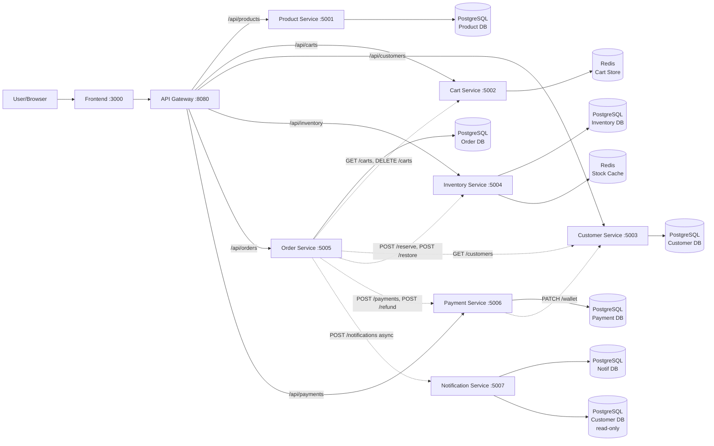

# System Architecture — Order Processing

> This document is completed **after** [Analysis and Design](analysis-and-design-order-processing.md).
> Based on the Service Candidates and Non-Functional Requirements identified there, select appropriate architecture patterns and design the deployment architecture.

**References:**
1. *Service-Oriented Architecture: Analysis and Design for Services and Microservices* — Thomas Erl (2nd Edition)
2. *Microservices Patterns: With Examples in Java* — Chris Richardson
3. *Bài tập — Phát triển phần mềm hướng dịch vụ* — Hung Dang (available in Vietnamese)

---

## 1. Pattern Selection

| Pattern | Selected? | Business / Technical Justification |
|---------|-----------|-------------------------------------|
| API Gateway | ✅ | Single entry point for all client requests; Nginx routes `/api/*` to the correct internal service by path prefix; handles JWT validation, CORS, and rate limiting; decouples frontend from internal service topology |
| Database per Service | ✅ | Each service owns its own isolated database (PostgreSQL or Redis) — prevents data-layer coupling and enables independent deployability and scaling |
| Shared Database | ❌ | Rejected — would couple services at the data layer, eliminate independent deployability, and create schema conflicts between domains |
| Saga (Orchestration) | ✅ | Order Service orchestrates a multi-step transaction spanning Cart, Inventory, Customer, and Payment services; Cancel Saga applies compensating transactions (restore inventory → refund payment → update order status) |
| Event-driven / Message Queue | ❌ | Out of scope for MVP — synchronous REST calls are sufficient; Notification Service uses fire-and-forget HTTP POST rather than a full message broker |
| CQRS | ❌ | Read/write ratio does not justify the added complexity at this scale |
| Circuit Breaker | ❌ | Not implemented — failures surface as 503 immediately (fail-fast); acceptable for MVP scope |
| Service Registry / Discovery | ❌ | Docker Compose DNS provides static service discovery via service names (e.g., `http://inventory-service:5004`) — no dynamic registry needed |
| Redis Cache | ✅ | Inventory Service uses Redis for atomic stock operations (INCRBY / DECRBY) to prevent oversell under concurrent orders; Cart Service uses Redis as primary store (hash per customer, TTL 7 days) |

> Reference: *Microservices Patterns* — Chris Richardson, chapters on decomposition, data management, and communication patterns.

---

## 2. System Components

| Component | Responsibility | Tech Stack | Port |
|-----------|----------------|------------|------|
| **Frontend** | Responsive SPA for customers to browse products, manage cart, place and cancel orders | HTML + Tailwind + Vanilla JS | 3000 |
| **API Gateway** | Reverse proxy — routes `/api/*` requests to the correct internal service; handles JWT validation, CORS, and rate limiting | Nginx | 8080 |
| **Product Service** | Owns product catalog and categories — read-only access for customers to browse and search products | FastAPI + PostgreSQL | 5001 |
| **Cart Service** | Owns shopping cart state per customer — add, update, remove items; stores cart in Redis with 7-day TTL | FastAPI + Redis | 5002 |
| **Customer Service** | Owns customer profiles, delivery addresses, and internal wallet balance; called by Order Service during saga | FastAPI + PostgreSQL | 5003 |
| **Inventory Service** | Owns stock levels per product; uses Redis atomic ops to reserve and restore stock; critical path for preventing oversell | FastAPI + PostgreSQL + Redis | 5004 |
| **Order Service** | Orchestrates Order Saga; owns transactional data (orders, order_items); handles Cancel Saga compensating transactions | FastAPI + PostgreSQL | 5005 |
| **Payment Service** | Owns payment records; processes COD acknowledgement and wallet deduction; handles refunds on cancel | FastAPI + PostgreSQL | 5006 |
| **Notification Service** | Sends order confirmation and status-change notifications via email / push; called asynchronously (fire-and-forget) | FastAPI + PostgreSQL | 5007 |

---

## 3. Communication

### Inter-service Communication Matrix

| From → To | Product | Cart | Customer | Inventory | Order | Payment | Notification | Gateway | DB (own) |
|-----------|:---:|:---:|:---:|:---:|:---:|:---:|:---:|:---:|:---:|
| **Frontend** | ❌ | ❌ | ❌ | ❌ | ❌ | ❌ | ❌ | ✅ REST | ❌ |
| **API Gateway** | ✅ proxy `/api/products` | ✅ proxy `/api/carts` | ✅ proxy `/api/customers` | ✅ proxy `/api/inventory` | ✅ proxy `/api/orders` | ✅ proxy `/api/payments` | ❌ | — | ❌ |
| **Product Service** | — | ❌ | ❌ | ❌ | ❌ | ❌ | ❌ | ❌ | ✅ PG |
| **Cart Service** | ❌ | — | ❌ | ❌ | ❌ | ❌ | ❌ | ❌ | ✅ Redis |
| **Customer Service** | ❌ | ❌ | — | ❌ | ❌ | ❌ | ❌ | ❌ | ✅ PG |
| **Inventory Service** | ❌ | ❌ | ❌ | — | ❌ | ❌ | ❌ | ❌ | ✅ PG + Redis |
| **Order Service** | ❌ | ✅ GET cart, DELETE cart | ✅ GET customer | ✅ POST reserve, POST restore | — | ✅ POST payment, POST refund | ✅ POST notify (async) | ❌ | ✅ PG |
| **Payment Service** | ❌ | ❌ | ✅ PATCH wallet | ❌ | ❌ | — | ❌ | ❌ | ✅ PG |
| **Notification Service** | ❌ | ❌ | ✅ GET customer (email) | ❌ | ❌ | ❌ | — | ❌ | ✅ PG |

> All inter-service calls use synchronous HTTP/REST over Docker Compose internal DNS, except Notification Service calls which are fire-and-forget (Order Service does not await response).

---

## 4. Architecture Diagram



> Solid lines = client-initiated requests via Gateway. Dashed lines = internal service-to-service calls (Order Saga and Cancel Saga).

---

## 5. Saga Flow Summary

### Order Saga — Happy Path

```
Order Service
  │
  ├─► Cart Service          GET /carts/{customer_id}            → CartItem[]
  ├─► Inventory Service     POST /inventory/reserve             → 200 OK | 409
  ├─► Customer Service      GET /customers/{id}                 → Customer
  │   [validate voucher, calculate total]
  │   [INSERT Order PENDING + OrderItems]
  ├─► Payment Service       POST /payments                      → Payment
  │   [UPDATE Order → CONFIRMED, COMMIT]
  ├─► Cart Service          DELETE /carts/{customer_id}         (async)
  └─► Notification Service  POST /notifications ORDER_CONFIRMED (async, fire-and-forget)
```

### Cancel Saga — Compensating Transactions

```
Order Service
  │   [validate: status must be PENDING or CONFIRMED]
  ├─► Inventory Service     POST /inventory/restore             → 200 OK
  ├─► Payment Service       POST /payments/{id}/refund          → 200 OK (WALLET only)
  │   [UPDATE Order → CANCELLED, COMMIT]
  └─► Notification Service  POST /notifications ORDER_CANCELLED (async, fire-and-forget)
```

---

