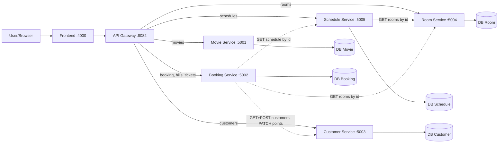

# System Architecture

> This document is completed **after** [Analysis and Design](analysis-and-design.md).
> Based on the Service Candidates and Non-Functional Requirements identified there, select appropriate architecture patterns and design the deployment architecture.

**References:**
1. *Service-Oriented Architecture: Analysis and Design for Services and Microservices* — Thomas Erl (2nd Edition)
2. *Microservices Patterns: With Examples in Java* — Chris Richardson
3. *Bài tập — Phát triển phần mềm hướng dịch vụ* — Hung Dang (available in Vietnamese)

---

## 1. Pattern Selection

| Pattern | Selected? | Business/Technical Justification |
|---------|-----------|----------------------------------|
| API Gateway | ✅ | Single entry point for all client requests; Nginx proxies to internal services by path prefix; decouples frontend from internal service topology |
| Database per Service | ✅ | Each service owns its own PostgreSQL database — prevents coupling at the data layer and enables independent deployability |
| Shared Database | ❌ | Rejected — would couple services at the data layer and eliminate independent deployability |
| Saga (Orchestration) | ✅ | Booking Service orchestrates a multi-step transaction spanning Schedule, Room, and Customer services; cancel saga (compensating transaction) calls Customer Service to restore points first, then commits local state changes (tickets + bill) atomically |
| Event-driven / Message Queue | ❌ | Out of scope for MVP — synchronous REST calls are sufficient; no async requirements |
| CQRS | ❌ | Read/write ratio does not justify the added complexity at this scale |
| Circuit Breaker | ❌ | Not implemented — failures surface as 503 immediately (fail-fast); acceptable for MVP |
| Service Registry / Discovery | ❌ | Docker Compose DNS provides static service discovery via service names — no dynamic registry needed |

> Reference: *Microservices Patterns* — Chris Richardson, chapters on decomposition, data management, and communication patterns.

---

## 2. System Components

| Component | Responsibility | Tech Stack | Port |
|-----------|----------------|------------|------|
| **Frontend** | SPA for customers to browse movies, view schedules, book and cancel tickets | HTML + Tailwind + Vanilla JS | 4000 |
| **API Gateway** | Reverse proxy — routes `/api/*` requests to the correct internal service; handles CORS | Nginx | 8082 |
| **Movie Service** | Owns movie catalog — read-only access for customers to browse movies | FastAPI + PostgreSQL | 5001 |
| **Room Service** | Owns screening rooms and seats; called internally by Schedule and Booking Services | FastAPI + PostgreSQL | 5004 |
| **Schedule Service** | Owns showtime lifecycle — exposes schedules to customers; called by Booking Service during saga | FastAPI + PostgreSQL | 5005 |
| **Customer Service** | Owns customer profile and loyalty point balance; called by Booking Service during saga | FastAPI + PostgreSQL | 5003 |
| **Booking Service** | Orchestrates booking saga; owns transactional data (bills, tickets); handles compensating transactions on cancel | FastAPI + PostgreSQL | 5002 |

---

## 3. Communication

### Inter-service Communication Matrix

| From → To | Movie | Room | Schedule | Customer | Booking | Gateway | DB (own) |
|-----------|:---:|:---:|:---:|:---:|:---:|:---:|:---:|
| **Frontend** | ❌ | ❌ | ❌ | ❌ | ❌ | ✅ REST | ❌ |
| **API Gateway** | ✅ proxy `/api/movies` | ✅ proxy `/api/rooms` | ✅ proxy `/api/schedules` | ✅ proxy `/api/customers` | ✅ proxy `/api/booking`, `/api/bills`, `/api/tickets` | — | ❌ |
| **Movie Service** | — | ❌ | ❌ | ❌ | ❌ | ❌ | ✅ |
| **Room Service** | ❌ | — | ❌ | ❌ | ❌ | ❌ | ✅ |
| **Schedule Service** | ❌ | ✅ GET /rooms/{id}/seats | — | ❌ | ❌ | ❌ | ✅ |
| **Customer Service** | ❌ | ❌ | ❌ | — | ❌ | ❌ | ✅ |
| **Booking Service** | ❌ | ✅ GET /rooms/{id}/seats | ✅ GET /schedules/{id} | ✅ GET+POST /customers, PATCH /points | — | ❌ | ✅ |

> All inter-service calls use synchronous HTTP/REST over Docker Compose internal DNS (e.g., `http://schedule-service:5005`).

---

## 4. Architecture Diagram

> Solid lines = client-initiated requests via Gateway. Dashed lines = internal service-to-service calls (Booking Saga).

---

## 5. Deployment

- All services containerized with Docker
- Orchestrated via Docker Compose
- Single command: `docker compose up --build`
- Service DNS resolution via Docker Compose network (e.g., `http://schedule-service:5005`)
- Each service has `GET /health` → `{"status": "ok"}` for liveness checks
